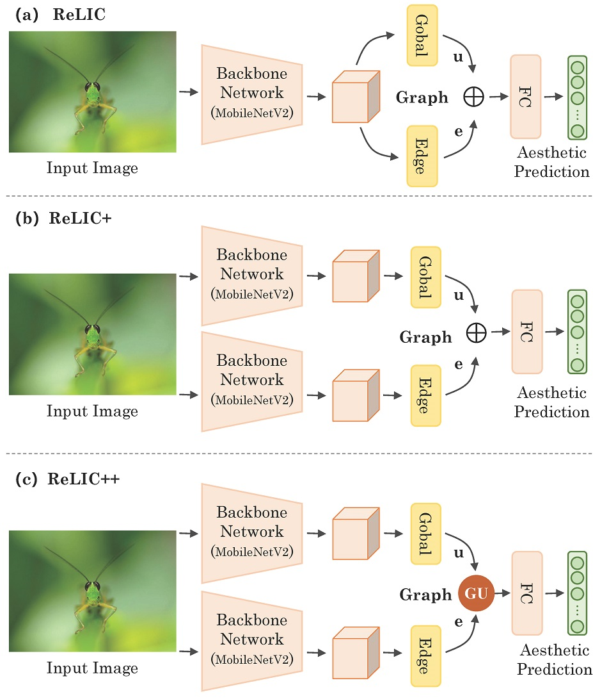

# ReLIC
> Pytorch code for our work "Representation Learning of Image Composition for Aesthetic Evaluation".

## Requirements

- pytorch 
- torchvision
- tqdm
- requests

## Code (folder)

- It contains AVA, CPC, JAS_composition, JAS_aesthetic.
  - AVA: aesthetic prediction on the AVA dataset;
  - CPC: composition prediciotn on the CPC dataset;
  - JAS_composition: composition prediction on the JAS dataset;
  - JAS_aesthetic: aesthetic prediction on the JAS dataset;
- Pretrained models are released in ``pretrain_model``
  - ``e`` denotes ``ReLIC_e``
  - ``u`` denotes ``ReLIC_u``
  - ``ReLIC`` denotes ``ReLIC``
  - ``ReLIC1`` denotes ``ReLIC+``
  - ``ReLIC2`` denotes ``ReLIC++``
- you can change the ``'path_to_model_weight'`` in ``option.py`` and run ``start_check_model`` in ``main.py``
- if you want to train your own models, please run ``start_train`` in ``main.py``  

## Data (folder)

- ``data`` contains the dataset split of three datasets: AVA, JAS, CPC; 
  - [AVA: A Large-Scale Database for Aesthetic Visual Analysis][http://refbase.cvc.uab.es/files/MMP2012a.pdf]
  - CPC: [The Comparative Photo Composition (CPC) database][]
  - JAS: [JENAESTHETICS DATASET- A PUBLIC COLLECTION OF PAINTINGS FOR AESTHETICS RESEARCH][http://www.inf-cv.uni-jena.de/jenaesthetics.html]
- each of them have three files: ``train.csv``, ``test.csv`` and ``val.csv`` 

## Results

